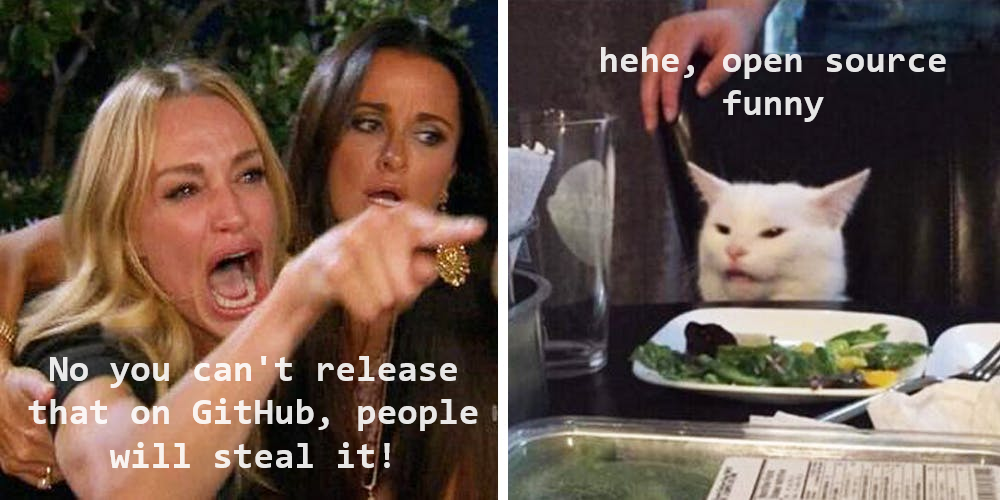

# Atian Tools

[](https://github.com/ate47/atian-cod-tools/actions/workflows/build.yml)

My set of tools. The code is more important than the features, so feel free to reuse it. 🙂



**Table of contents**

- [Atian Tools](#atian-tools)
	- [GSC Compiler/Decompiler](#gsc-compilerdecompiler)
	- [Dumper](#dumper)
	- [GSC Decrypter](#gsc-decrypter)
	- [ACTS Lib](#acts-lib)
	- [Dependencies](#dependencies)
	- [Downloads](#downloads)
	- [Related repositories](#related-repositories)
	- [Lookup](#lookup)
	- [Credits](#credits)


## GSC Compiler/Decompiler

**Supported game**

| Name                     | Rev | Decompiler | Compiler | Type(s) | Source\* |
| ------------------------ | -------- | ---------- | -------- | ---------| ----- |
| Black Ops 3 (T7)         | 1B       | Partial    | ✅        | pc | [ate47/bo3-source](https://github.com/ate47/bo3-source) |
| Black Ops 3 (T7)         | 1C       | ✅          | ✅        | pc,ps4 | [ate47/bo3-source](https://github.com/ate47/bo3-source) |
| Black Ops 4 (T8)         | 31       | ✅          | ✅        | ps4 | [ate47/oldcod-source](https://github.com/ate47/oldcod-source) |
| Black Ops 4 (T8)         | 34       | ✅          | ✅        | ps4 | [ate47/oldcod-source](https://github.com/ate47/oldcod-source) |
| Black Ops 4 (T8)         | 35       | Partial          | ❌        | pc | None |
| Black Ops 4 (T8)         | 36       | ✅          | ✅        | pc,ps4 | [ate47/bo4-source](https://github.com/ate47/bo4-source) |
| Black Ops Cold War (T9)  | 37       | Dc        | ✅        | pc,ps4,alpha| [ate47/bocw-source](https://github.com/ate47/bocw-source) |
| Black Ops Cold War (T9)  | 38       | Dc        | ✅        | pc,ps4| [ate47/bocw-source](https://github.com/ate47/bocw-source) |
| Modern Warfare III (JUP) | 8A       | ✅          | ✅      | pc | [ate47/mwiii-source](https://github.com/ate47/mwiii-source) |
| Modern Warfare III (JUP) | 8B       | Dc        | ✅       | pc | [ate47/mwiii-source](https://github.com/ate47/mwiii-source) |
| Black Ops 6 (T10)        | 06       | Dc & Ex  | ✅        | alpha | [ate47/bo6-source](https://github.com/ate47/bo6-source) |
| Black Ops 6 (T10)        | 07       | Dc & Ex  | Ex       |  - | [ate47/bo6-source](https://github.com/ate47/bo6-source) |
| Black Ops 6 (T10)        | 0B       | Dc & Ex  | Ex      |  -  | [ate47/bo6-source](https://github.com/ate47/bo6-source) |
| Black Ops 6 (T10)        | 0C       | Dc & Ex  | Ex      |  - | [ate47/bo6-source](https://github.com/ate47/bo6-source) |

- \* : Some source repositories might not be public yet.
- **Dc**: With pre-decode, see the [GSC Decrypter section](#gsc-decrypter).
- **Ex**: With extensions, ***The extensions aren't provided publicly, at least not by me.***

**Commands**
```pwsh
# Compile gsc file

acts gscc <input.gsc> -g <game> (-p <type>)

# Example
# Compile my_script.gsc into a cold war script
acts gscc my_script.gsc -g cw

# Compile my_script.gsc into a cold war script for ps4
acts gscc my_script.gsc -g cw -p ps4
```

```pwsh
# Decompile gsc file
acts gscd <input.gscc> -g (-t <type>)

# Example

# Decompile the script compiled.gscc
acts gscd compiled.gscc -g

# Decompile the script compiled.gscc from a ps4 dump
acts gscd compiled.gscc -g -t ps4
```

## Dumper

**Supported pools**

- Black Ops 3: `scriptbundle`, `stringtable`, `structuredtable`, `rawfile`, `scriptparsetree`.
- Black Ops 4: `weapon`, `customizationtable`, `rawfile`, `stringtable`, `structuredtable`, `ddl`, `scriptparsetree`, `scriptparsetreeforced`, `scriptbundle`, `scriptbundlelist`, `ttf`, `bgcache`, `maptable`, `maptablelist`, `maptableloadingimages`, `maptablepreviewimages`, `playerrolecategory`, `playerrolecategorytable`, `gametypetable`, `unlockableitem`, `unlockableitemtable`, `playlists`, `hierarchicaltasknetwork`, `storagefile`, `storagefilelist`, `storeproduct`, `storecategory`, `storecategorylist`, `rank`, `ranktable`, `prestige`, `prestigetable`, `labelstore`, `labelstorelist`, `rawstring`.
- Black Ops Cold War (Dec): `rawfile`, `rawfilepreproc`, `rawtextfile`, `stringtable`, `scriptparsetree`, `scriptbundle`.
- Modern Warfare III (COR): `gscobj`, `scriptbundle`, `stringtable`, `localize`, `luafile`, `ddl`.
- Black Ops 6 (COR): `gscobj`.

- **DEC**: Requires pre-decode
- **COR**: Using [Cordycep](https://github.com/Scobalula/Cordycep).

**Commands**
```pwsh
# Command
acts dp <pool>

# Example
acts dp stringtable
```

Some dumpers are writing to Compiled Files (.cf), the command cfd (cf dump) can extract them.

```pwsh
# Command
acts cfd <files>

# Example
acts cfd output_dump
```

## GSC Decrypter

For the games after cw, the function to decrypt the strings isn't integrated inside acts. The scripts should be decrypted before giving them to the decompiler.

***This method requires a dumped exe of the game and will execute it.***

```pwsh
# Decrypt the scripts
acts scripts_decrypt <dumped game executable> <game> <encrypted dump> <output dir>

# Example with a cw dump
acts scripts_decrypt BlackOpsColdWar_dump.exe cw gsc_dump gsc_dump_dec
```

## ACTS Lib

Prototype libary for random stuff, probably not linked to Call of Duty.

## Dependencies

This tool is using and providing different dependencies, see [LICENSE.md](LICENSE.md) for a full list.

## Downloads

You can download the latest release here:

- [Latest Release](https://github.com/ate47/atian-cod-tools/releases/latest)
- [Latest Dev Build](https://github.com/ate47/atian-cod-tools/releases/tag/latest_build) (Might be unstable)

## Related repositories

- [ate47/t8-atian-menu](https://github.com/ate47/t8-atian-menu/tree/master/docs/notes) : All the notes and dump generated by this tool. (All games)
- [ate47/BOHashTool](https://github.com/ate47/BOHashTool) : Tool to test hashes with error (en/de)coder for Black Ops games

## Lookup

To have a lookup over the extracted hashes, you can use a file named `strings.txt` when using the process, it will be loaded automatically, one string per line.

You can also use .wni compiled files, create a directory with the name `package_index` and put the .wni files in it.

The tool `download_hash_index` allows to download the latest hash index from [ate47/HashIndex](https://github.com/ate47/HashIndex).

## Credits

- [Serious's t8-compiler](https://github.com/shiversoftdev/t7-compiler) for some opcodes for Black Ops 4, it fasted up the process of understanding the internal game functions. Also for the childthread operator syntax.
- [JariKCoding's CoDLuaDecompiler](https://github.com/JariKCoding/CoDLuaDecompiler) to understand the Lua HK scripting format.
