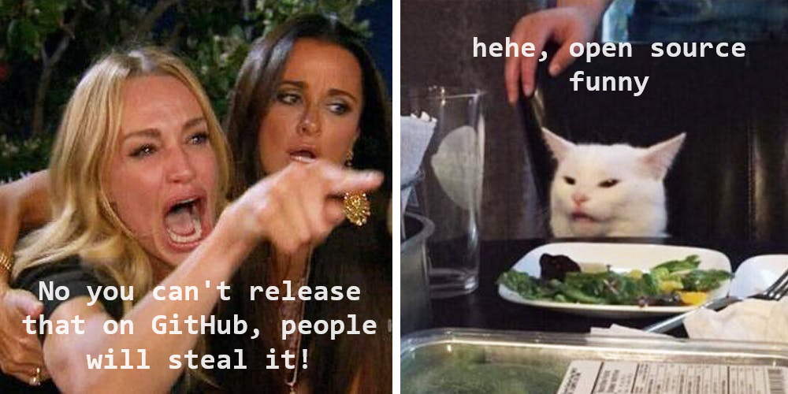

# Atian Tools

[](https://github.com/ate47/atian-cod-tools/actions/workflows/build.yml)

My set of tools. The code is more important than the features, so feel free to reuse it. 🙂



## Dependencies

This tool is using and providing different dependencies, see [LICENSE.md](LICENSE.md) for a full list.

## Downloads

You can download the latest release here:

- [Latest Release](https://github.com/ate47/atian-cod-tools/releases/latest)
- [Latest Dev Build](https://github.com/ate47/atian-cod-tools/releases/tag/latest_build) (Might be unstable)

The tool `checkupdate` allows to check for the latest update.

## Fast Files

Fast Files (ff) are compressed archives containing the different assets of the Call of Duty games.

### Fast Files Dumpers

The dumpers extract the fast files assets.

**Supported games and assets**

| Game                  | Reader | Handler   | Pools      |
| --------------------- | ------ | --------- | ---------- |
| Black Ops 3           | ✅      | `bo3`     | `rawfile`, `scriptparsetree` |
| Black Ops 4           | ✅      | `bo4`     | `aitype`, `arenaseasons`, `bgcache`, `character`, `characterbodytype`, `cpu_occlusion_data`, `customization`, `ddl`, `entitlement`, `entitlementlist`, `firstpartyentitlement`, `firstpartyentitlementlist`, `gametypetable`, `hierarchical_task_network`, `keyvaluepairs`, `localize_entry`, `luafile`, `comworld`, `entity_list`, `gfxworld`, `maptable`, `maptable_list`, `maptable_preview_images`, `trigger_list`, `objective`, `player_outfit`, `player_role_category`, `player_role_category_table`, `player_role_template`, `playlists`, `playlist_global_settings`, `playlist_schedule`, `rank`, `ranktable`, `prestige`, `prestigetable`, `rawstring`, `scriptbundle`, `scriptbundlelist`, `scriptparsetree`, `scriptparsetreedbg`, `sound`, `sprayorgestureitem`, `sprayorgesturelist`, `storagefile`, `storagefilelist`, `storeproduct`, `storecategory`, `storecategorylist`, `labelstore`, `labelstorelist`, `sku`, `streamkey`, `stringtable`, `structured_table`, `unlockable_item`, `unlockable_item_table`, `weapon`, `weapon_camo`, `weapon_tunables`, `zbarrier` |
| Modern Warfare 2019   | ✅      | `mw19`      | `rawfile`, `scriptfile` (gpl\*), `luafile`, `localize` |
| Black Ops Cold War    | ✅      | `cw`      | `rawfile`, `scriptparsetree`, `using`, `scriptbundle`, `bgcache`, `ddl`, `localizeentry`, `keyvaluepairs`, `weapon_frontend`, `zbarrier` |
| Vanguard              | ✅      | `vg`      | `rawfile`, `scriptfile` (gpl\*), `luafile`, `localize` |
| Modern Warfare II     | ✅      | `mwii`    | `rawfile`, `scriptfile` (gpl\*), `luafile`, `stringtable`, `ddl`, `scriptbundle`, `localize` |
| Modern Warfare II SP  | ✅      | `mwiisp`  | `rawfile`, `scriptfile` (gpl\*), `luafile`, `stringtable`, `ddl`, `scriptbundle`, `localize` |
| Modern Warfare III    | ✅      | `mwiii`   | `rawfile`, `gscobj`, `luafile`, `stringtable`, `ddl`, `scriptbundle`, `localize` |
| Modern&nbsp;Warfare&nbsp;III&nbsp;SP | ✅      | `mwiiisp` | `rawfile`, `gscobj`, `luafile`, `stringtable`, `ddl`, `scriptbundle`, `localize` |
| Black Ops 6           | ✅      | `bo6`     | `rawfile`, `gscobj`, `gscgdb`, `luafile`, `aitype`, `scriptbundle`, `stringtable`, `keyvaluepairs`, `netconststrings`, `operator`, `operatorlist`, `reactiveoperator`, `operatorskin`, `spray`, `contraildata`, `parachutedata`, `ddl`, `aishootstyleslist`, `ai_token_types`, `ai_token_stealing_definitions`, `ai_token_definitions`, `localize`, `soundbank`, `soundbanktransient` |
| Black Ops 6 SP        | ✅      | `bo6sp`   | `rawfile`, `gscobj`, `gscgdb`, `stringtable`, `ddl`, `scriptbundle`, `netconststrings`, `luafile`, `aitype`, `localize` |
| Black Ops 7           | ✅      | `bo7`     | `rawfile`, `gscobj`, `gscgdb`, `luafile`, `aitype`, `scriptbundle`, `stringtable`, `keyvaluepairs`, `netconststrings`, `operator`, `operatorlist`, `reactiveoperator`, `operatorskin`, `spray`, `contraildata`, `parachutedata`, `ddl`, `aishootstyleslist`, `ai_token_types`, `ai_token_stealing_definitions`, `ai_token_definitions`, `localize`, `soundbank`, `soundbanktransient` |

- gpl\*: Only working within the GPL-3 distribution using [xensik/gsc-tool](https://github.com/xensik/gsc-tool).

The `gsc` handler can read  `scriptparsetree`, `gscobj` or `scriptfile` pools from decompressed fastfiles.

See the wiki page [*Fast Files Dumper*](https://github.com/ate47/atian-cod-tools/wiki/Fast-Files---Dumper).

### Fast Files Linkers

The linkers create custom fast files.

**Supported games and assets**

| Game                  | Linker   | Pools      |
| --------------------- | --------- | ---------- |
| Black Ops 3           | `bo3`     | `scriptparsetree` |
| Black Ops 4           | `bo4`     | `aitype`, `character`, `rawfile`, `scriptparsetree`, `scriptparsetreedbg`, `scriptparsetreeforced`, `structuredtable`, `luafile`, `rawstring`, `scriptbundle`, `stringtable`, `image`, `keyvaluepairs`, `objective`,  `rank`, `ranktable`, `prestige`, `prestigetable`, `localize`, `ttf`, `bgcache`, `zbarrier` |
| Black&nbsp;Ops&nbsp;Cold&nbsp;War    | `cw`     | `rawfile`, `scriptparsetree`, `scriptparsetreedbg`, `using`, `bgcache`, `localize`, `keyvaluepairs`  |

See the wiki page [*Fast Files Linker*](https://github.com/ate47/atian-cod-tools/wiki/Fast-Files---Linker).

## Game Script Code (GSC)

The GSC file format contains the scripts used by the different games.

**Supported games**

| Name                     | Rev | Decompiler | Compiler | Type(s)      | Source\*                                                      |
| ------------------------ | --- | ---------- | -------- | ------------ | ------------------------------------------------------------- |
| Black Ops 3 (T7)         | 1A  | ✅          | ✅        | pc           | None       |
| Black Ops 3 (T7)         | 1B  | Partial    | ✅        | pc           | [ate47/oldcod-source](https://github.com/ate47/oldcod-source)       |
| Black Ops 3 (T7)         | 1C  | ✅          | ✅        | pc,ps4       | [ate47/bo3-source](https://github.com/ate47/bo3-source)       |
| Black Ops 4 (T8)         | 31  | ✅          | ✅        | ps4          | [ate47/oldcod-source](https://github.com/ate47/oldcod-source) |
| Black Ops 4 (T8)         | 34  | ✅          | ✅        | pc,ps4       | [ate47/oldcod-source](https://github.com/ate47/oldcod-source) |
| Black Ops 4 (T8)         | 35  | Partial    | ❌        | pc           | None                                                          |
| Black Ops 4 (T8)         | 36  | ✅          | ✅        | pc,ps4       | [ate47/bo4-source](https://github.com/ate47/bo4-source)       |
| Black Ops Cold War (T9)  | 37  | Dc         | ✅        | pc,ps4,alpha | [ate47/oldcod-source](https://github.com/ate47/oldcod-source)     |
| Black Ops Cold War (T9)  | 38  | Dc         | ✅        | pc,ps4       | [ate47/bocw-source](https://github.com/ate47/bocw-source)     |
| Modern Warfare III (JUP) | 8A  | ✅          | ✅        | all         | [ate47/mwiii-source](https://github.com/ate47/mwiii-source)   |
| Modern Warfare III (JUP) | 8B  | Dc         | ✅        | all         | [ate47/mwiii-source](https://github.com/ate47/mwiii-source)   |
| Black Ops 6 (T10)        | 06  | Dc         | ✅        | all         | [ate47/bo6-source](https://github.com/ate47/bo6-source)       |
| Black Ops 6 (T10)        | 07  | Dc         | ✅        | all         | [ate47/bo6-source](https://github.com/ate47/bo6-source)       |
| Black Ops 6 (T10)        | 0B  | Dc         | ✅        | all         | [ate47/bo6-source](https://github.com/ate47/bo6-source)       |
| Black Ops 6 (T10)        | 0C  | Dc         | ✅        | all         | [ate47/bo6-source](https://github.com/ate47/bo6-source)       |
| Black Ops 6 (T10)        | 0D  | Dc         | ✅        | all         | [ate47/bo6-source](https://github.com/ate47/bo6-source)       |
| Black Ops 6 (T10)        | 0E  | Dc         | ✅        | all         | [ate47/bo6-source](https://github.com/ate47/bo6-source)       |
| Black Ops 6 (T10)        | 10  | Dc         | ✅        | all         | [ate47/bo6-source](https://github.com/ate47/bo6-source)       |
| Black Ops 6 (T10)        | 11  | Dc         | ✅        | all         | [ate47/bo6-source](https://github.com/ate47/bo6-source)       |
| Black Ops 6 (T10)        | 12  | Dc         | ✅        | all         | [ate47/bo6-source](https://github.com/ate47/bo6-source)       |
| Black Ops 6 (T10)        | 14  | Dc         | ✅        | bo6+bo6_v1  | [ate47/bo6-source](https://github.com/ate47/bo6-source)       |
| Black Ops 7 (SAT)        | 14  | Dc         | ✅        | bo7         | [ate47/bo7-source](https://github.com/ate47/bo7-source)       |
| Black Ops 7 (SAT)        | 16  | Dc         | ✅        | all         | [ate47/bo7-source](https://github.com/ate47/bo7-source)       |
| Black Ops 7 (SAT)        | 18  | Dc         | ✅        | all         | [ate47/bo7-source](https://github.com/ate47/bo7-source)       |
| Black Ops 7 (SAT)        | 19  | Dc         | ✅        | all         | [ate47/bo7-source](https://github.com/ate47/bo7-source)       |
| Black Ops 7 (SAT)        | 1a  | Dc         | ✅        | all         | [ate47/bo7-source](https://github.com/ate47/bo7-source)       |

- \* : Some source repositories might not be public yet.
- **Dc**: With pre-decode, see the [Using encrypted page](https://github.com/ate47/atian-cod-tools/wiki/GSC-Decompiler#using-encrypted-scripts).
- **Ex**: With extensions, ***The extensions aren't provided publicly, at least not by me.***

See the wiki pages [*GSC Compiler*](https://github.com/ate47/atian-cod-tools/wiki/GSC---Compiler) or [*GSC Decompiler*](https://github.com/ate47/atian-cod-tools/wiki/GSC---Decompiler) for more information.

## Hash Utilities

Various games use hashes, the lookup is done using the [ate47/HashIndex](https://github.com/ate47/hashindex), it needs to be downloaded using `acts download_hash_index`, the [echo000/cod-name-db](https://github.com/echo000/cod-name-db) index can also be downloaded using `acts download_hash_index echo000-cndb`.

Atian Tools contains multiple utilities for brute forcing hashes, replace hashes in files or scan for them. A list can be obtained using `acts list hash`.

## Game DLLs

Different dlls were created to add features to existing games

### Black Ops 3

**File**: `acts-bo3.dll`

**Features**:

- Allow loading of script debug information in the zone directory, can be generated by the decompiler or [downloaded here](https://github.com/ate47/bo3-source/blob/main/scriptgdb.zip).

### Project Black Ops 4 Plugin

*This dll is made as a plugin for [project-bo4/shield-development](https://github.com/project-bo4/shield-development), it doesn't work as an independant addon.*

**File**: `acts-shield-plugin.dll`

**Features**:

- Translate error messages
- Add custom GSC functions
- Allow loading GSC detours and lazy links
- Add custom LUA functions
- Allow loading custom fastfiles

### Black Ops Cold War

**File**: `acts-bocw.dll`

**Features**:

- Allow loading GSC lazy links

### Developers

This project is open for more features, see [CONTRIBUTING.md](.github\CONTRIBUTING.md) for more information.

### Setup

**External tools**

- `cmake` is required to setup the project.
- `clang-format` is required to format the project, a formatter code is mandatory for pull requests.
- `antlr4` is required to recompile the grammar files used by the different compilers. It can be downloaded using [`scripts/antlr.ps1`](scripts/antlr.ps1).

**Path structure**

- `/cmake` : cmake scripts
- `/config` : config files, used by tools
- `/config/data` : config files packages with acts
- `/deps` : external projects
- `/examples` : acts API examples
- `/grammar` : grammar files used by antlr4
- `/include` : includes for the acts API
- `/licenses` : used licenses
- `/scripts` : scripts used by the ci or developers
- `/src` : source directory
- `/tools` : source directory for the tools used to compile the files into the source directory

### Plugins and API

Atian Tools supports plugin, see [ate47/atian-cod-tools-plugin-example](https://github.com/ate47/atian-cod-tools-plugin-example) for an example, the api can be obtained in the release zip or in the [`include/`](include/). 

API examples are available in [`examples/`](examples/).

### GitHub Actions

To use the acts command in a GitHub workflow, the [ate47/setup-acts](https://github.com/ate47/setup-acts) action can be used.

```yml
- name: Install Atian Tools
    uses: ate47/setup-acts@v1
    with:
    # Atian Tools version to install, latest for the latest version, latest_build 
    # for the latest prerelease build.
    # Default: latest
    version: latest

    # Download the hash index with Atian Tools
    # Default: false
    hashindex: false
```

## Wiki

See the [Wiki](https://github.com/ate47/atian-cod-tools/wiki) to know how to use the other features
